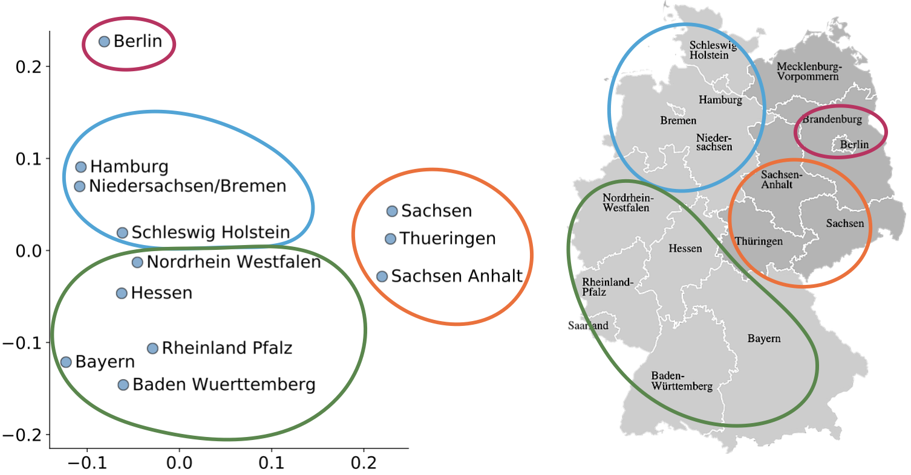

# Embedding of categorical features

Download data from  [Kaggle](https://www.kaggle.com/c/rossmann-store-sales/data): `train.csv`, `test.csv`,  `store.csv` .

Requirements (Python 3):

```
scikit-learn
keras
```
Prepare features and train embeddings:

```
python prep_features.py
python train_embeddings.py
python plot_embeddings.py
```

Evaluate different models using the trained embeddings:

```
python train_test_model.py
```

Visualize the trained embeddings, e.g., German states:




